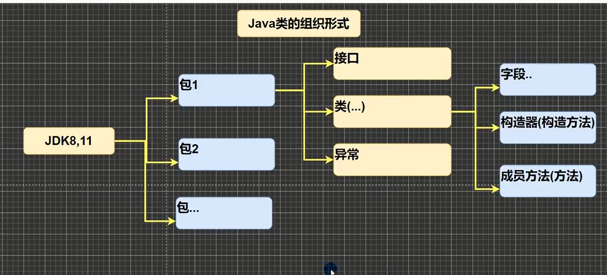
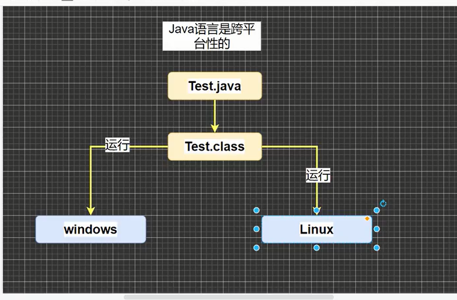
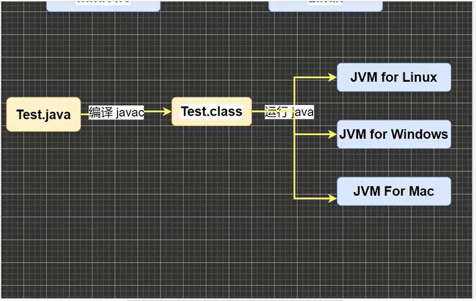

# 一、前言
* 程序：计算机执行某些操作或者解决某些问题而编写的一系列有序指令集合
* Java的诞生：sun公司 绿色计划 09年被甲骨文收购（8，11版本LTS） 1995年发布第一版本
* Java版本：
  1.  Java SE(Java standard Edition)Java标准版本,提供完整Java核心API，支持面向桌面级应用
  2. Java EE(Java Enterprise Edition)企业版,主要针对web应用程序开发，包含Servlet,Jsp等
  3. Java ME(Java Micro Edition)小型版,支持Java程序运行在移动终端（手机，PAD）平台，对Java API 有所精简，并加入了针对移动端的支持
* Java API文档 https://matools.com 
* Java类组织形式
* unicode码 (https://tool.chinaz.com/Tools/Unicode.aspx)
# 二、Java特性
* Java语言是面向对象的（oop）
* Java语言是健壮的。强类型机制，异常处理，垃圾自动收集的等是Java健壮性的保证
* Java语言是跨平台的
* Java语言是解释型的
  * 解释性语言：JavaScript，PHP，Java；编程性语言：C/C++
  1. 解释性语言编译后的代码，不能直接被机器执行，需要解释器来执行。
  2. 编程性语言编译后的代码可以直接被机器执行。
* Java语言是健壮的。强类型机制，异常处理，垃圾自动收集的等是Java健壮性的保证
# 三、Java机制和运行过程
## 3.1 JDK(Java development Kit)Java开发工具包
* JDK=(JRE+Java开发工具（Java，Javac，Javadoc，Javap等）)
* JDK是提供给Java开发人员使用的
## 3.2 JRE(Java Runtime Environment)Java运行环境
* JRE= (JVM【Java虚拟机】+Java核心库)
## 3.3 Java核心机制--Java虚拟机JVM【Java virtual machine】
* JVM 是一个虚拟计算机，具有指令集并使用不同存储区域，负责执行指令，管理数据，内存，寄存器包含在JDK中
* 对于不同平台，运行不同虚拟机
* Java虚拟机屏蔽了底层运行平台的差异，实现了<span style="color:red;font-weight:800;">“一次编译，到处运行”</span>
* 有了JVM（包含在JDK中） 同一个Java程序在不同操作系统中都可以执行------Java跨平台
* javac hello.java=====>hello.class 编译Java文件
* Java hello ====> 运行Java文件
* 
## 3.4 Java 语法细节
* <span style="color:red;font-weight:800;">Java语言区分大小写</span>
* <span style="color:red;font-weight:800;">语句以;结尾</span>
* <span style="color:red;font-weight:800;">一个源文件中最多有一个Public类，其他类不限，编译后每个类都对应一个.class文件</span>
* <span style="color:red;font-weight:800;">如果一个文件包含一个Public类，则文件名为该类名</span>
# 四、DOS命令
## 4.1 原理
* DOS(Disk Operating System)磁盘操作系统
* 相对路径：从当前目录开始定位，形成的一个路径
* 绝对路径：从顶级目录开始定位，形成的路径
## 4.2常用DOS命令
1. 删除目录：rd 文件夹名
2. 创建目录：md 文件夹名 
3. 拷贝文件：copy 文件夹名
4. 删除文件：del 文件夹名
5. 输入内容到文件：echo 内容>文件全称：echo 你好>hello.txt;(echo会覆盖内容)
6. 创建空文件：type null>文件全称
7. 剪切/移动：move 文件名
8. 查看当前目录有什么：dir 文件名 ； dir d:\abc\test
9. 切换到其他盘下：切换到D盘：D: 切换到C盘：C:
10. 进入当前盘的其他目录：cd 相对路径或者绝对路径；cd ..\..\abc\test[相对路径];cd c:abc\test[绝对路径]
11. 返回上一级： cd..
12. 切换到根目录：cd \
13. 退出命令提示符（CMD）：exit
14. 查看目录树 ： 当前目录 tree；或者tree 想查看的目录
15. 清屏：cls
# 五、字符编码
1. ASCII：ASCII编码表，1个字节表示，1个字节8位256个字符，但是ASCII只用了128个字符
2. Unicode：Unicode编码表，固定大小的编码，使用2个字节来表示字符，字母和汉字都占用2个字节（浪费空间），兼容ASCII码，不会乱码
3. UTF-8：大小可变的编码，字母使用1个字节，汉字使用3个字节（对Unicode改进）
4. gbk：可以表示汉字，而且范围广，字母1个字节，汉字2个字节
5. gb2312：可以表示汉字，gb2312<gbk
6. big5码：繁体中文，台湾，香港
# 六、变量
## 6.1、基本数据类型
* <span style="color:purple;font-weight:800;">一个字节byte = 8位bit</span>
1. 数值型
   1. 整数：byte[1],short[2],int[4],long[8]（l/L）
        1. byte x = 8;(一个字节8位) 00001000
        2. <span style="color:red;font-weight:800;">long x2 = 16;(2个字节16位) 0000000000010000</span>
   2. 浮点数：单精度float[4]（f/F）,双精度Double[8]（d/D）
        1. 浮点数存放形式：符号位+指数位+尾数为
        2. 尾数部分可能丢失造成精度损失（小数都是近似值）
        3. <span style="color:red;font-weight:800;">浮点型常量默认值为Double,声明float类型时，必须加f/F或者强制转换类型(float)1.2</span>
2. 字符型
   1.char[2]存放单个字符
   2.String Java API字符串
3. 布尔型：Boolean[1],true,false
### 6.1.1数值型的使用
>double a = 2.7;
>double b = 8.1/3;//2.6999999999999997-------输出近似2.7的
><span style="color:red;font-weight:800;">对小数进行相等判断的时候要小心，应该以两个数值的差的绝对值在某个精度范围类来判断Math.abs()</span>;
```java
package src;

import java.lang.reflect.Array;
import java.sql.SQLOutput;

public class jiben01_基本数据类型{
    static byte x = 22 ;
    short x2 = (short) 20L;//l表示long型
    long x3;
    int x4;
    //浮点型常量默认值为Double,声明float类型时，必须加f/F或者强制转换类型(float)1.2
    float y1 = (float) 1.1;
    float y2 = 1.2f;

    double y3 = .22;//o.22
    double y4 = 5.12e2;//科学计数法：5.12*10^2
    double y5 = 5.12e-2;//科学计数法：5.12除于10^2

    char z1 = 's';
    static String z2= "nihao";
    Array t[] = new Array[7];

    //    强制转换 Cast to类型
    static char z3 = (char) x;

    public static void main(String[] args) {
        float x = 1.234567459f; //1.2345674-------保留7位数
        float x2 = 1.234567465f;//1.2345675
        double y = 1.234567890;//1.23456789
        System.out.println(x);
        System.out.println(x2);
        System.out.println(y);
        System.out.println("---------------------------------------");

        double a = 2.7;
        double b = 8.1/3;//2.6999999999999997-------输出近似2.7的
        System.out.println(a);
        System.out.println(b);
        if(Math.abs(a-b)<0.0001) { //Java API====Math.abs() 判断绝对值
            System.out.println("相等");
        } else {
            System.out.println("不相等");
        }
        System.out.println("--------对小数进行相等判断的时候要小心,应该以两个数值的差的绝对值在某个精度范围类来判断------------");

        System.out.println(z2+z3);
    }
}

```
### 6.1.2 字符的使用
- char类型是可以进行运算的，相当于一个整数，因为它有对应的unicode码
- <span style="color:red;font-weight:800;">字符型存储：找到对应的Unicode码==》二进制==》存储</span>
- <span style="color:red;font-weight:800;">字符型读取：二进制==》unicode码===》字符</span>
```java
package src;

public class 字符的使用 {
    public static void main(String[] args) {
        char c1 = 'a';
        char c2 = '\n'; //直接转义输出即被换行
        char c3 = '中';
        char c4 = 97; //char可以直接存放一个数字----unicode码 (https://tool.chinaz.com/Tools/Unicode.aspx)输出 a
        char c5 = '王';
        int x = c5;
        System.out.println(c1);
        System.out.println(c2);
        System.out.println(c3);
        System.out.println(c4);
        System.out.println(x); //输出‘王’对应的unicode码
    }
}

```
### 6.1.3 布尔型的使用
- boolean类型占用的空间是1个字节：true或者false
- 用于逻辑运算和流程控制
```java
package src;

public class 布尔类型03 {
    static boolean y = false;
    public static void main(String[] args) {
        char x = 'R';
        add();
        if(y) {
            System.out.println((int)x);
        } else {
            System.out.println("假的");
        }
    }
    public static void add() {
        y = true;
    }
}

```
## 6.2、引用数据类型
1. 类（class）
2. 接口（interface）
3. 数组（Array）
## 6.3 强制转换
* 强制类型转换：大转小会损失精度，小转大不会
## 6.4 自动类型转换

# 七、运算
## 7.1 算数运算
## 7.2 关系运算
## 7.3 逻辑运算
## 7.4 三元运算
# 八、进制