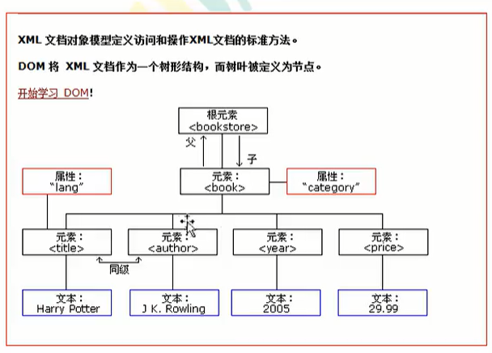

# 一、初识xml
## 1.1 什么是xml
* xml是可扩展的标记性语言
* xml元素： 从开始标签到结束标签的部分，分为单标签和双标签,内容必须在根标签中
* xml属性： 属性可以提供元素的额外信息，每个属性的值必须用引号引起了
## 1.2 xml 注释
```xml
<!--xml文件的声明
version表示版本
encoding表示本身编码
-->
<?xml version="1.0" encoding="UTF-8"?>
<stuents name="Rrincil" age="19">
  <student>
    <name>Rrincil2</name>
  </student>
  <stuent name="Rrincil3"/>
</stuents>
```
## 1.3 xml的作用
* 主要作用：
    1. 用来保存数据,而且这些数据是具有描述性的
    2. 作为项目或者模块的控制文件
    3. 作为网络数据传输的格式（现在 json为主）
# 二、xml语法
## 2.1 命名规则
1. 名称可以含有字母数字以及其他字符
2. 名称不能以数字或者标点符号开始
3. 名称不能以字母xml或者XML开始
4. 名称不能包含空格
## 2.2 文本区域（CDATA）
* CDATA语法  <![CDATA[这里是纯文本，不会被解析]]]>
* CDATA文本内的不会被xml语法解析，仅是纯文本
```xml
<stuents >
  <student>
    <name>
      <![CDATA[
      我是Rrincil2》》》》》？》》》
      ]]]>
    </name>
  </student>
  <stuent name="Rrincil3"/>
</stuents>
```
# 三、xml解析技术
* 不管是Html还是xml都是标记性语言，都可以使用W3C组织制定的Dom技术来解析
* 
## 3.1 xml解析原理
1. 早期JDK中提供两种xml解析技术Dom和Sax【Simple API for Xml类似事件机制通过回调告诉用户当前解析的内容】(<span style="color:red;font-weight:800;">已经过时</span>)
2. 第三方解析
    1. jdom ：在dom上封装
    2. dom4j： 在jdom上封装
    3. pull：主要用在Android手机开发，和Sax类似
## 3.2 dom4j解析技术
- 需要下载dom4j的jar包
* 通过标签名查找子元素 element(),elements()[返回多个]
* 获取标签中的文本内容 name.getText()或者name.elementText("指定标签")
* 获取属性的值：String attrvalue = Student.attributeValue("属性名")