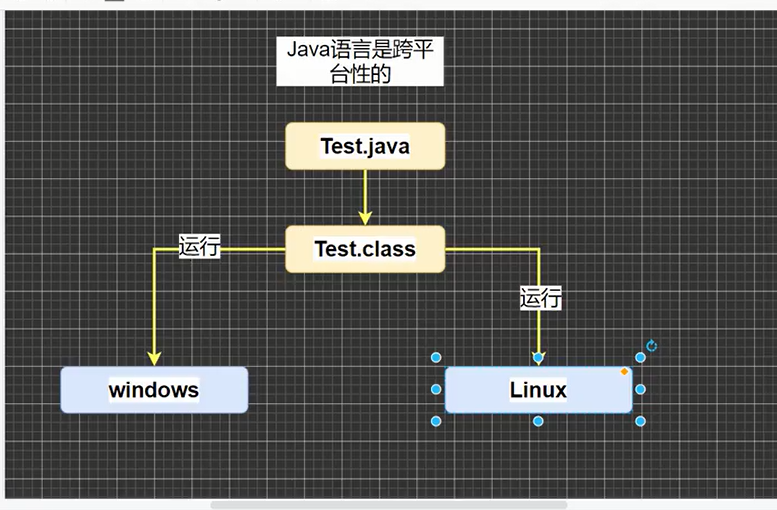
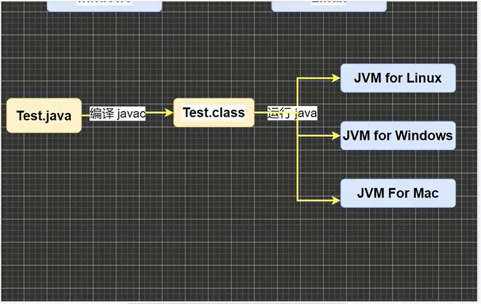

# 一、前言
* 程序：计算机执行某些操作或者解决某些问题而编写的一系列有序指令集合
* Java的诞生：sun公司 绿色计划 09年被甲骨文收购（8，11版本LTS） 1995年发布第一版本
* Java版本：
  1.  Java SE(Java standard Edition)Java标准版本,提供完整Java核心API，支持面向桌面级应用
  2. Java EE(Java Enterprise Edition)企业版,主要针对web应用程序开发，包含Servlet,Jsp等
  3. Java ME(Java Micro Edition)小型版,支持Java程序运行在移动终端（手机，PAD）平台，对Java API 有所精简，并加入了针对移动端的支持
# 二、Java特性
* Java语言是面向对象的（oop）
* Java语言是健壮的。强类型机制，异常处理，垃圾自动收集的等是Java健壮性的保证
* Java语言是跨平台的
* Java语言是解释型的
  * 解释性语言：JavaScript，PHP，Java；编程性语言：C/C++
  1. 解释性语言编译后的代码，不能直接被机器执行，需要解释器来执行。
  2. 编程性语言编译后的代码可以直接被机器执行。
* Java语言是健壮的。强类型机制，异常处理，垃圾自动收集的等是Java健壮性的保证
# 三、Java机制和运行过程
## 3.1 JDK(Java development Kit)Java开发工具包
* JDK=(JRE+Java开发工具（Java，Javac，Javadoc，Javap等）)
* JDK是提供给Java开发人员使用的
## 3.2 JRE(Java Runtime Environment)Java运行环境
* JRE= (JVM【Java虚拟机】+Java核心库)
## 3.3 Java核心机制--Java虚拟机JVM【Java virtual machine】
* JVM 是一个虚拟计算机，具有指令集并使用不同存储区域，负责执行指令，管理数据，内存，寄存器包含在JDK中
* 对于不同平台，运行不同虚拟机
* Java虚拟机屏蔽了底层运行平台的差异，实现了“一次编译，到处运行”
* 有了JVM（包含在JDK中） 同一个Java程序在不同操作系统中都可以执行------Java跨平台
* javac hello.java=====>hello.class 编译Java文件
* Java hello ====> 运行Java文件
* 
## 3.4 Java 语法细节
* Java语言区分大小写
* 语句以;结尾
* 一个源文件中最多有一个Public类，其他类不限，编译后每个类都对应一个.class文件
* 如果一个文件包含一个Public类，则文件名为该类名

# 四、Java